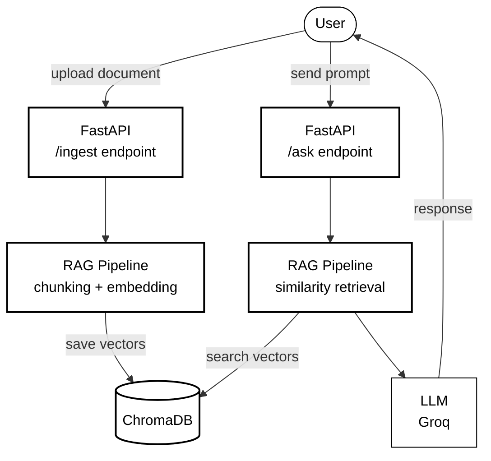

# SecondBrain-API
SecondBrain is a backend service that allows uploading documents and querying them in natural language. The LLM responds based exclusively on the uploaded documents, citing the exact sources. It uses a RAG pipeline with ChromaDB as the vector database and Groq as the free LLM.

## Stack
- **FastAPI** - Modern Python framework for API REST development
- **LangChain** - Python lib that provides the tools to build the RAG pipeline and orchestrate the agent
- **ChromaDB** - Vector database for storing and retrieving embeddings
- **Groq** - Groq — Free LLM API (Llama 3)
- **sentence-transformers** - Python library for generating text embeddings locally, used for both document ingestion and query retrieval
## Architecture

## How to use
0. Create a .env file with your Groq API key
   GROQ_API_KEY=your_key_here
   
1. Install dependencies
   pip install -r requirements.txt

2. Start the app
   1. Start with uvicorn (development)
      - `uvicorn app:app --reload`

   2. Start with Docker (recommended)
      - `docker build -t secondbrain-api .`
      - `docker run -p 8000:8000 --env-file .env secondbrain-api`

3. Upload a document
   POST /ingest  →  { "file": "document.txt" }

4. Ask a question
   POST /ask  →  { "prompt": "What does the contract say about deadlines?" }

## Notes
see [notes.md](notes.md)
